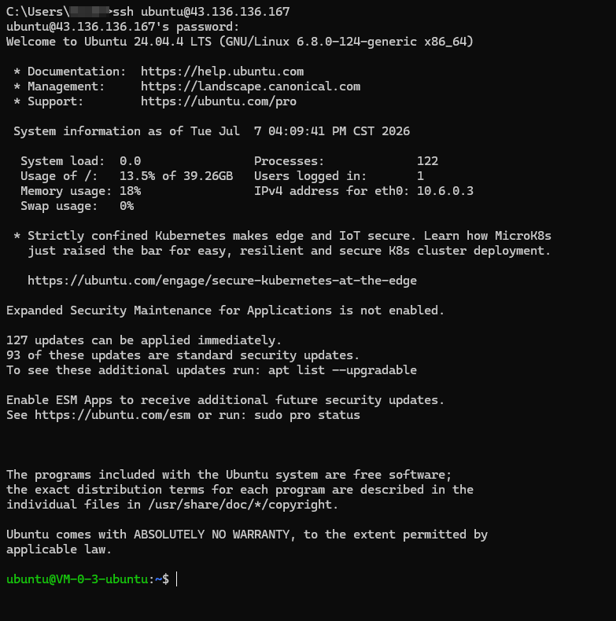
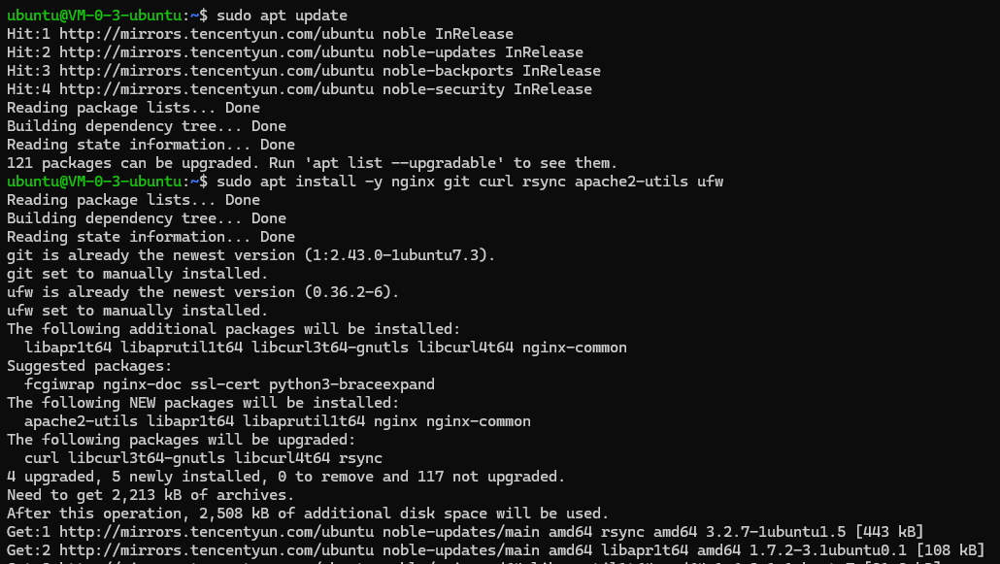
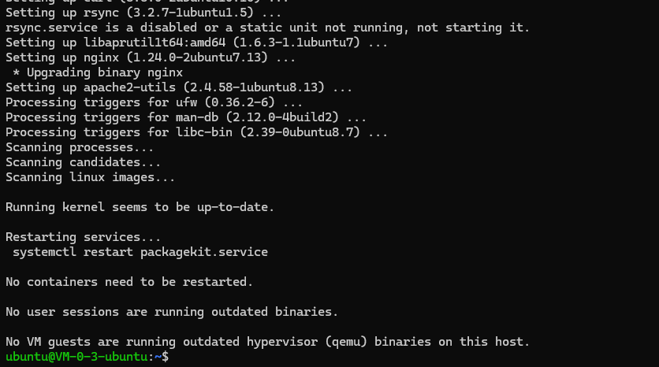
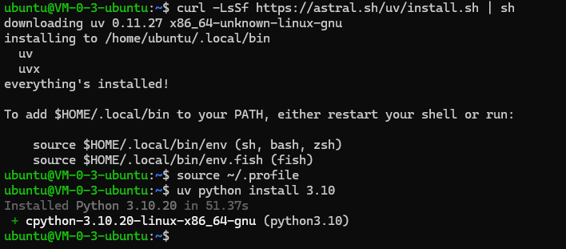
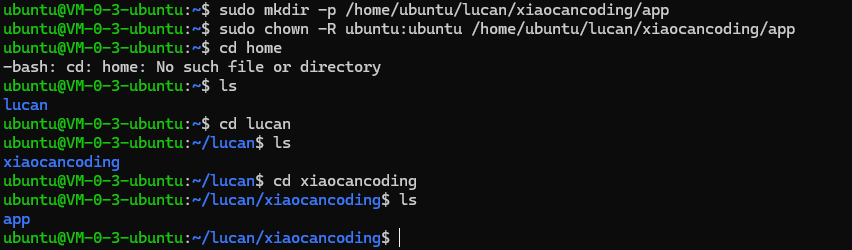
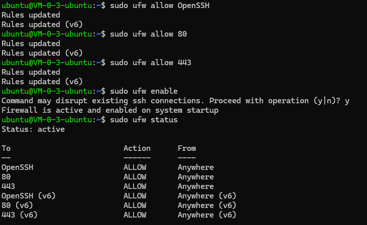
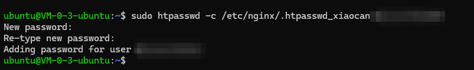

**部署目标**

你的文章全部开源，所以博客本身可以公开访问。需要保护的是：

- 管理前端 `/admin/`
- 管理后端 `/api/`
- 服务器 SSH
- GitHub Actions 部署密钥
- 后端管理员账号密码

最终部署结构：

```text
main 分支
  -> GitHub Actions
  -> GitHub Pages
  -> 公开博客

develop 分支
  -> GitHub Actions
  -> 腾讯云服务器 43.136.136.167
  -> 公开博客 + 受保护的管理端
```

当前没有域名，因此线上访问形态为：

```text
http://43.136.136.167/          公开博客
http://43.136.136.167/admin/   管理前端，需 Nginx 访问密码 + 应用登录
http://43.136.136.167/api/     管理后端，仅 Nginx 转发，不直接暴露端口
```

线上访问形态：

```text
https://你的域名/          公开博客
https://你的域名/admin/   管理前端，需访问密码 + 应用登录
https://你的域名/api/     管理后端，仅 Nginx 转发，不直接暴露端口
```

---

**一、上线前准备**

1. 当前服务器信息：

```text
服务器公网 IP：43.136.136.167
服务器登录用户：ubuntu
SSH 端口：22
操作系统：Ubuntu 24.04 LTS
项目部署目录：/home/ubuntu/lucan/xiaocancoding/app
```

2. GitHub 分支策略：

```text
main：公开生产博客，部署到 GitHub Pages
develop：部署到自有服务器，包含管理端
```

日常开发先合入 `develop`，在服务器验证无误后，再合入 `main` 发布公开博客。

3. 当前没有域名，因此暂时不配置 HTTPS。

后续如果购买域名，需要：

```text
域名 A 记录 -> 43.136.136.167
Nginx server_name 改成真实域名
PRODUCTION_DOMAIN 改成 https://真实域名
再执行 certbot 配置 HTTPS
```

**二、服务器初始化**

登录服务器：

```bash
ssh ubuntu@43.136.136.167
```



安装基础组件：

```bash
sudo apt update
sudo apt install -y nginx git curl rsync apache2-utils ufw
```





安装 Python 3.10 管理工具 `uv`：

```bash
curl -LsSf https://astral.sh/uv/install.sh | sh
source ~/.profile
uv python install 3.10
```



创建部署目录：

```bash
mkdir -p /home/ubuntu/lucan/xiaocancoding/app
sudo chown -R ubuntu:ubuntu /home/ubuntu/lucan
```
检查目录：

```bash
ls -ld /home/ubuntu/lucan
ls -ld /home/ubuntu/lucan/xiaocancoding
ls -ld /home/ubuntu/lucan/xiaocancoding/app
```



---

**三、服务器安全策略**

防火墙只开放必要端口：

```bash
sudo ufw allow OpenSSH
sudo ufw allow 80
sudo ufw allow 443
sudo ufw enable
sudo ufw status
```



不要开放这些端口：

```text
18000  后端端口，只监听 127.0.0.1
14000  本地开发端口，线上不用开放
3400   本地开发端口，线上不用开放
```

管理后端真实运行在：

```text
127.0.0.1:18000
```

只能由 Nginx 访问，公网不能直接访问。

---

**四、配置管理端访问密码**

管理端采用两层保护：

1. Nginx Basic Auth：进入 `/admin/` 和 `/api/` 前先输浏览器访问密码。
2. 你项目自己的后台登录：`LUCHUAN_ADMIN_USERNAME` / `LUCHUAN_ADMIN_PASSWORD`。

创建 Nginx 访问密码：

```bash
sudo htpasswd -c /etc/nginx/.htpasswd_xiaocan yourname
```
执行后会要求输入密码。这里输入的是浏览器访问 `/admin/` 时弹窗使用的密码。

最终浏览器弹窗账号为：

```text
用户名：lucan
密码：执行 htpasswd 时你自己输入的密码
```


---

**五、配置后端 systemd 服务**

`systemd` 用来让管理后端常驻运行，并在服务器重启后自动启动。

创建服务文件：

```bash
sudo tee /etc/systemd/system/xiaocan-admin-backend.service >/dev/null <<'EOF'
[Unit]
Description=Xiaocan Coding Admin Backend
After=network.target

[Service]
User=ubuntu
WorkingDirectory=/home/ubuntu/lucan/xiaocancoding/app/admin/backend
EnvironmentFile=/home/ubuntu/lucan/xiaocancoding/app/admin/backend/.env
ExecStart=/home/ubuntu/lucan/xiaocancoding/app/admin/backend/.venv/bin/python -m uvicorn scr.main:app --host 127.0.0.1 --port 18000
Restart=always
RestartSec=5

[Install]
WantedBy=multi-user.target
EOF
```

启用服务：

```bash
sudo systemctl daemon-reload
sudo systemctl enable xiaocan-admin-backend
```

注意：此时先不要手动启动服务。因为代码、`.env` 和 `.venv` 还没有部署完成，直接启动会失败。后续 GitHub Actions 部署完成后会自动重启它。

---

**六、配置 Nginx**

规则：

- `/`：公开访问博客
- `/admin/`：需要 Basic Auth
- `/api/`：需要 Basic Auth，并反向代理到后端

创建 Nginx 配置：

```bash
sudo tee /etc/nginx/sites-available/xiaocancoding >/dev/null <<'EOF'
server {
    listen 80;
    server_name 43.136.136.167;

    root /home/ubuntu/lucan/xiaocancoding/app/site/build;
    index index.html;

    location / {
        try_files $uri $uri/ /404.html;
    }

    location = /admin {
        return 301 /admin/;
    }

    location /admin/ {
        auth_basic "Private Admin";
        auth_basic_user_file /etc/nginx/.htpasswd_xiaocan;

        alias /home/ubuntu/lucan/xiaocancoding/app/admin/frontend/dist/;
        try_files $uri $uri/ /admin/index.html;
    }

    location /api/ {
        auth_basic "Private API";
        auth_basic_user_file /etc/nginx/.htpasswd_xiaocan;

        proxy_pass http://127.0.0.1:18000;
        proxy_http_version 1.1;
        proxy_set_header Host $host;
        proxy_set_header X-Real-IP $remote_addr;
        proxy_set_header X-Forwarded-For $proxy_add_x_forwarded_for;
        proxy_set_header X-Forwarded-Proto $scheme;
    }
}
EOF
```

启用配置：

```bash
sudo ln -sf /etc/nginx/sites-available/xiaocancoding /etc/nginx/sites-enabled/xiaocancoding
sudo rm -f /etc/nginx/sites-enabled/default
sudo nginx -t
sudo systemctl reload nginx
```

---

**七、当前不配置 HTTPS**

当前没有域名，因此先使用 HTTP：

```text
http://43.136.136.167/
http://43.136.136.167/admin/
```

后续如果有域名，再执行 HTTPS 配置。

域名解析生效后，将 Nginx 中的：

```nginx
server_name 43.136.136.167;
```

改为：

```nginx
server_name 你的真实域名;
```

然后执行：

```bash
sudo apt install -y certbot python3-certbot-nginx
sudo certbot --nginx -d 你的真实域名
```

同时 GitHub Secret 中的 `PRODUCTION_DOMAIN` 也要从：

```text
http://43.136.136.167
```

改为：

```text
https://你的真实域名
```

---

**八、配置 GitHub Secrets**

进入 GitHub 仓库：

```text
lucan6290/lucan6290.github.io
```

打开：

```text
Settings -> Secrets and variables -> Actions -> New repository secret
```

需要添加这些 Secrets：

```text
SERVER_HOST=43.136.136.167
SERVER_PORT=22
SERVER_USER=ubuntu
SERVER_SSH_KEY=部署私钥全文

PRODUCTION_DOMAIN=http://43.136.136.167

LUCHUAN_ADMIN_USERNAME=lucan
LUCHUAN_ADMIN_PASSWORD=你的管理后台登录密码
LUCHUAN_AUTH_SECRET=随机生成的 token 签名密钥
```

其中：

```text
LUCHUAN_ADMIN_PASSWORD
```

是进入管理后台应用后的登录密码，不要写进文章，也不要提交到 Git。

`LUCHUAN_AUTH_SECRET` 是后端签名登录 token 使用的密钥，不是登录密码。可以在服务器或本机执行：

```bash
openssl rand -hex 32
```

将生成结果填入 GitHub Secret：

```text
LUCHUAN_AUTH_SECRET
```

不要把生成结果写进 Git 仓库。

---

**九、生成 GitHub Actions 部署密钥**

GitHub Actions 需要通过 SSH 登录服务器并同步代码，因此需要一组专门用于自动部署的 SSH 密钥。

在 Windows 本机 PowerShell 执行：

```powershell
ssh-keygen -t ed25519 -C "github-actions-xiaocancoding" -f $env:USERPROFILE\.ssh\xiaocan_deploy_ed25519
```

生成两个文件：

```text
C:\Users\lucan\.ssh\xiaocan_deploy_ed25519      私钥，放到 GitHub Secret: SERVER_SSH_KEY
C:\Users\lucan\.ssh\xiaocan_deploy_ed25519.pub  公钥，放到服务器 ~/.ssh/authorized_keys
```

查看公钥内容：

```powershell
Get-Content $env:USERPROFILE\.ssh\xiaocan_deploy_ed25519.pub
```

登录服务器，将公钥加入 `authorized_keys`：

```bash
mkdir -p ~/.ssh
chmod 700 ~/.ssh
echo "这里粘贴 xiaocan_deploy_ed25519.pub 文件内容" >> ~/.ssh/authorized_keys
chmod 600 ~/.ssh/authorized_keys
```

查看私钥全文：

```powershell
Get-Content $env:USERPROFILE\.ssh\xiaocan_deploy_ed25519
```

将私钥全文填入 GitHub Secret：

```text
SERVER_SSH_KEY
```

注意：

```text
.pub 公钥可以放服务器
无后缀私钥只能放 GitHub Secret，不能提交到仓库，也不能写进文章
```

---

**十、develop 分支自动部署到自有服务器**

新增 workflow 文件：

```text
.github/workflows/deploy-develop-server.yml
```

内容如下：

```yaml
name: Deploy develop to private server

on:
  push:
    branches: [develop]
  workflow_dispatch:

concurrency:
  group: private-server-deploy
  cancel-in-progress: true

jobs:
  deploy:
    runs-on: ubuntu-latest

    steps:
      - name: Checkout
        uses: actions/checkout@v4

      - name: Setup Node
        uses: actions/setup-node@v4
        with:
          node-version: 20

      - name: Build blog
        working-directory: site
        run: |
          npm ci
          npm run build

      - name: Build admin frontend
        working-directory: admin/frontend
        env:
          VITE_API_BASE_URL: /api
        run: |
          npm ci
          npm run build

      - name: Configure SSH
        run: |
          mkdir -p ~/.ssh
          echo "${{ secrets.SERVER_SSH_KEY }}" > ~/.ssh/deploy_key
          chmod 600 ~/.ssh/deploy_key
          ssh-keyscan -p "${{ secrets.SERVER_PORT }}" -H "${{ secrets.SERVER_HOST }}" >> ~/.ssh/known_hosts

      - name: Sync project to server
        run: |
          rsync -az --delete \
            --exclude '.git/' \
            --exclude 'site/node_modules/' \
            --exclude 'admin/frontend/node_modules/' \
            --exclude 'admin/backend/.venv/' \
            --exclude '**/*.log' \
            -e "ssh -i ~/.ssh/deploy_key -p ${{ secrets.SERVER_PORT }}" \
            ./ ${{ secrets.SERVER_USER }}@${{ secrets.SERVER_HOST }}:/home/ubuntu/lucan/xiaocancoding/app/

      - name: Install backend and restart
        run: |
          ssh -i ~/.ssh/deploy_key -p "${{ secrets.SERVER_PORT }}" \
            "${{ secrets.SERVER_USER }}@${{ secrets.SERVER_HOST }}" << EOF
          set -e
          cd /home/ubuntu/lucan/xiaocancoding/app/admin/backend

          if [ ! -d .venv ]; then
            /home/ubuntu/.local/bin/uv venv --python 3.10 .venv
          fi

          . .venv/bin/activate
          /home/ubuntu/.local/bin/uv pip install -r requirements.txt

          cat > .env << ENVEOF
          LUCHUAN_ENV=prod
          LUCHUAN_PROJECT_ROOT=/home/ubuntu/lucan/xiaocancoding/app
          LUCHUAN_LOG_LEVEL=INFO
          LUCHUAN_CORS_ORIGINS=${{ secrets.PRODUCTION_DOMAIN }}
          LUCHUAN_ADMIN_USERNAME=${{ secrets.LUCHUAN_ADMIN_USERNAME }}
          LUCHUAN_ADMIN_PASSWORD=${{ secrets.LUCHUAN_ADMIN_PASSWORD }}
          LUCHUAN_AUTH_SECRET=${{ secrets.LUCHUAN_AUTH_SECRET }}
          LUCHUAN_AUTH_TOKEN_TTL_MINUTES=720
          ENVEOF

          sudo systemctl restart xiaocan-admin-backend
          sudo nginx -t
          sudo systemctl reload nginx
          EOF
```

最关键的一行是：

```yaml
VITE_API_BASE_URL: /api
```

否则管理前端上线后会错误请求浏览器本机的：

```text
127.0.0.1:18000
```

---

**十一、main 分支部署到 GitHub Pages**

项目已有 workflow：

```text
.github/workflows/deploy.yml
```

它负责：

```text
main -> build site -> GitHub Pages
```

GitHub Pages 设置位置：

```text
Settings -> Pages -> Source -> GitHub Actions
```

发布公开博客：

```bash
git checkout main
git pull origin main
git merge develop
git push origin main
```

---

**十二、正式发布流程**

推荐发布节奏：

```text
1. 本地开发
2. 提交到 feature 分支或 develop 分支
3. 合并到 develop
4. GitHub Actions 自动部署到腾讯云服务器
5. 访问 http://43.136.136.167/ 验证博客
6. 访问 http://43.136.136.167/admin/ 验证管理后台
7. 确认内容可以公开
8. 合并 develop 到 main
9. GitHub Pages 自动发布公开博客
```

部署到自有服务器：

```bash
git checkout develop
git pull origin develop
git push origin develop
```

验证无误后发布到 GitHub Pages：

```bash
git checkout main
git pull origin main
git merge develop
git push origin main
```

---

**十三、上线后检查**

服务器检查：

```bash
sudo systemctl status xiaocan-admin-backend
sudo journalctl -u xiaocan-admin-backend -n 100 --no-pager
sudo nginx -t
curl -I http://127.0.0.1
curl http://127.0.0.1:18000/api/v1/health
```

浏览器检查：

```text
http://43.136.136.167/
http://43.136.136.167/admin/
```

预期效果：

- 博客首页无需密码，公开可访问。
- `/admin/` 会先弹出 Nginx 访问密码。
- Basic Auth 用户名为 `lucan`。
- 进入后台后，还需要使用项目自己的管理员账号登录。
- 管理后台应用用户名为 `lucan`。
- `/api/` 不直接暴露公网端口，只能通过 Nginx 访问。
- 服务器公网不开放 `18000`、`14000`、`3400`。

---

**十四、常用排查命令**

查看后端服务状态：

```bash
sudo systemctl status xiaocan-admin-backend
```

查看后端日志：

```bash
sudo journalctl -u xiaocan-admin-backend -n 100 --no-pager
```

重启后端：

```bash
sudo systemctl restart xiaocan-admin-backend
```

检查 Nginx 配置：

```bash
sudo nginx -t
```

重载 Nginx：

```bash
sudo systemctl reload nginx
```

查看端口监听：

```bash
sudo ss -tulpn
```

确认后端只监听本机：

```bash
curl http://127.0.0.1:18000/api/v1/health
```

---

**十五、回滚方案**

最简单的回滚方式：

```bash
git revert 某个出问题的提交
git push origin develop
```

GitHub Actions 会重新部署回滚后的状态。

如果问题发生在公开博客：

```bash
git checkout main
git revert 某个出问题的提交
git push origin main
```

---

**最终部署结果**

```text
GitHub Pages:
  main 分支
  公开博客
  面向所有人

腾讯云服务器:
  develop 分支
  公开博客预览
  /admin/ 和 /api/ 使用 Nginx Basic Auth 保护
  管理后台应用账号 lucan
  后端只监听 127.0.0.1:18000
```

当前访问地址：

```text
公开博客：http://43.136.136.167/
管理后台：http://43.136.136.167/admin/
```
