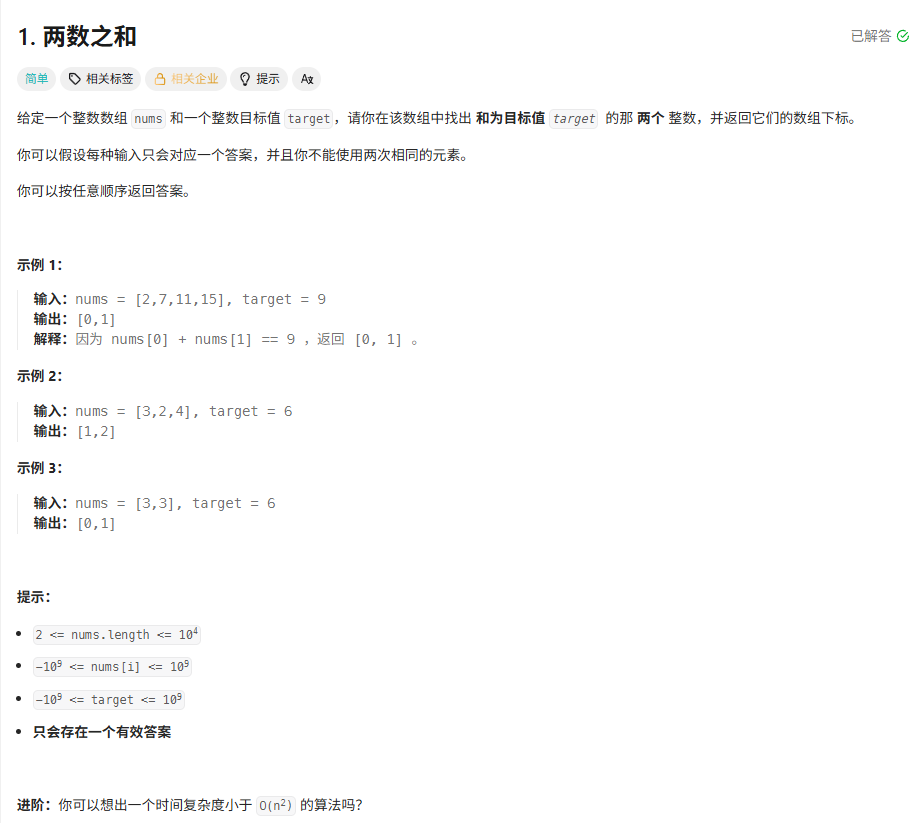
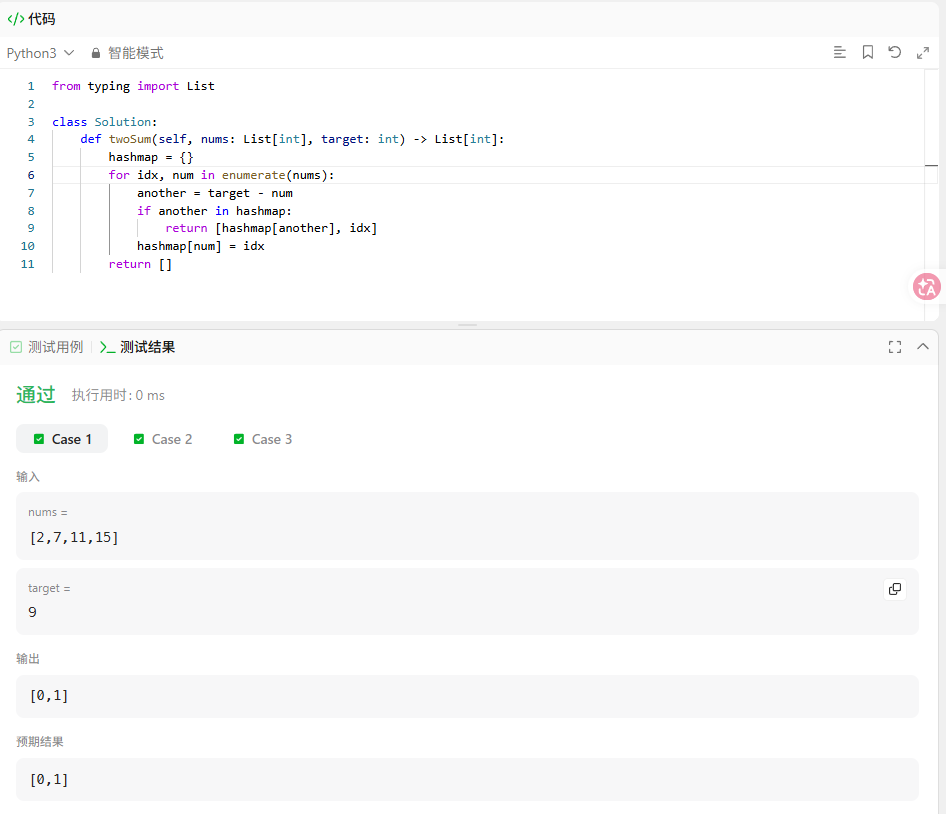
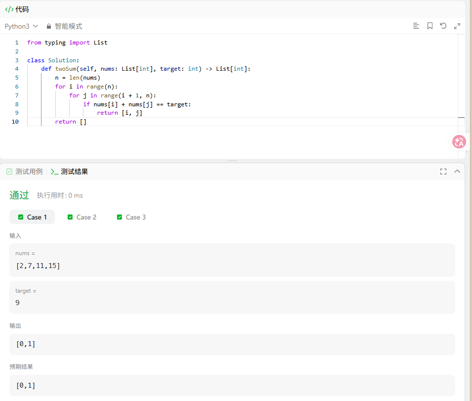

# 题目



# 题解
## 方法一：哈希表（时间复杂度 O(n)，最优进阶解法）
思路：遍历数组，用字典保存**数值:下标**，对当前数`num`，查找`target - num`是否已经在字典里；
- 存在：直接返回两个下标
- 不存在：把当前数和下标存入字典

```python
from typing import List

class Solution:
    def twoSum(self, nums: List[int], target: int) -> List[int]:
        hashmap = {}
        for idx, num in enumerate(nums):
            another = target - num
            if another in hashmap:
                return [hashmap[another], idx]
            hashmap[num] = idx
        return []
```



## 方法二：暴力双重循环（O(n²)，基础写法）
两层循环枚举所有两个不同元素组合，判断和是否等于target：
```python
from typing import List

class Solution:
    def twoSum(self, nums: List[int], target: int) -> List[int]:
        n = len(nums)
        for i in range(n):
            for j in range(i + 1, n):
                if nums[i] + nums[j] == target:
                    return [i, j]
        return []
```





### 核心说明
1. 题目保证**仅有一组唯一答案**，找到即可直接return，无需后续遍历
2. 哈希表解法不会重复使用同一个元素：因为先查差值再存当前值，不会取到本轮刚插入的自身下标
3. 针对`[3,3], target=6`用例：第一个3存入字典，遍历第二个3时，差值3已存在于字典，正确返回`[0,1]`。
